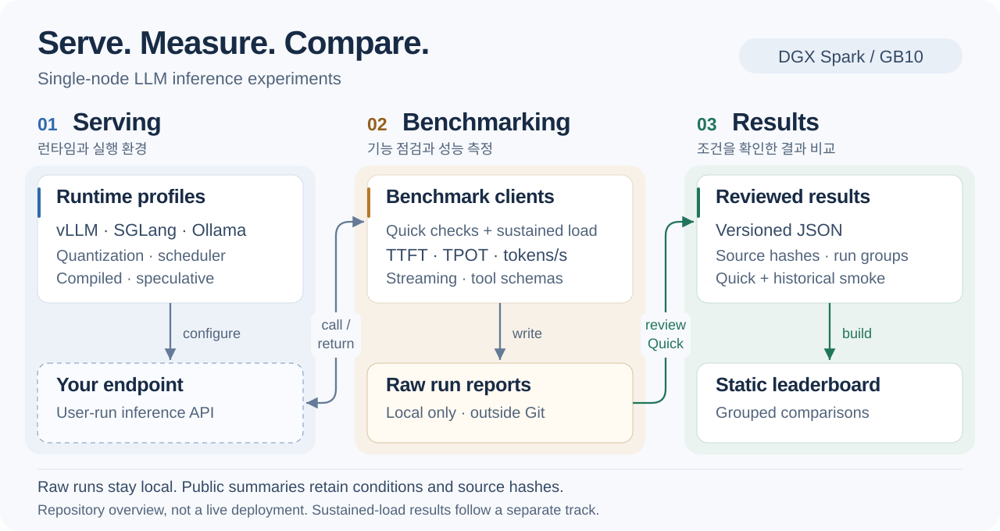

# LLM Inference Lab

English | [한국어](README.ko.md)

Serving configurations, benchmark clients, and measured results for single-node
LLM inference.

Use this repository to run a serving example, check an OpenAI-compatible
endpoint, or inspect recorded performance comparisons. Current profiles and
results focus on **DGX Spark / GB10**.

[Quick Start](#quick-start) · [Documentation](#documentation) · [Benchmark Results](#benchmark-results)

## Features

- **Serving configurations** — vLLM, SGLang, and Ollama examples, plus SparkRun
  launch recipes.
- **API compatibility checks** — model listing, text generation, streaming, and
  tool-call schema validation.
- **Performance measurement** — time to first token (TTFT), time per output
  token (TPOT), and output throughput, with a separate sustained-load runner.
- **Configuration comparisons** — scheduler limits, eager/compiled execution,
  quantization, and speculative-decoding settings.
- **Traceable results** — reviewed summaries with source hashes, comparison
  groups, and a static leaderboard generated from versioned JSON.

## Architecture At A Glance



The dashed endpoint is supplied and run by you; this is a repository overview,
not a live deployment. Only reviewed Quick results enter the normalized result
set through the current importer; historical smoke records remain unranked,
and sustained-load results follow a separate track.
See the [detailed evidence flow](benchmarks/results/README.md#evidence-flow).

<details>
<summary>Diagram source — Mermaid</summary>

This is the canonical structure for the shared SVG. The
[editable text](docs/assets/project-overview.json) and
[layout](docs/assets/project-overview.layout.svg) produce the presentation.
Review node and edge changes before updating the source hash.

```mermaid
flowchart LR
    accTitle: LLM Inference Lab project overview
    accDescr: Serving profiles configure a user-run endpoint. Benchmark clients exchange API requests and responses with that endpoint and write local raw reports. Reviewed Quick runs become public summaries and a generated leaderboard. Characterization stays on a separate results track.
    subgraph serving["Serving"]
        profiles["Runtime profiles<br/>vLLM · SGLang · Ollama"]
        endpoint["Your endpoint<br/>User-run inference API"]
    end
    subgraph benchmarking["Benchmarking"]
        clients["Benchmark clients<br/>Quick checks + sustained load"]
        raw["Raw run reports<br/>Local only; outside Git"]
    end
    subgraph evidence["Results"]
        results["Reviewed results<br/>JSON · hashes · comparison groups"]
        leaderboard["Static leaderboard<br/>Grouped comparisons"]
    end
    profiles -->|configure| endpoint
    endpoint <-->|call / return| clients
    clients -->|write| raw
    raw -->|review Quick| results
    results -->|build| leaderboard
```



</details>

## Quick Start

### Requirements

- Python 3 and Git for the steps below. The Quick client uses the Python
  standard library; no Python package installation is needed.
- An already-running endpoint that supports model listing, Chat Completions
  with streaming token usage, and tool calling.
- A Bash-compatible shell for these examples, such as Linux or WSL.

To start a model server first, choose a [serving guide](#documentation). Viewing
the recorded results does not require a server.

### Check an endpoint

Clone the repository, then replace `your-served-model` with the model name
exposed by your endpoint:

```bash
git clone https://github.com/bemaru/llm-inference-lab.git
cd llm-inference-lab

python3 benchmarks/openai-compatible/quick_check.py \
  --base-url http://127.0.0.1:8000/v1 \
  --model your-served-model \
  --performance-prompt-profile sequential-integers
```

The command prints a JSON report with check results and performance metrics.
A nonzero exit status indicates a failed check or execution error. It calls
your endpoint; it does not start a model server or download weights.

The default request includes vLLM's `chat_template_kwargs`. For servers that
reject this field, pass `--omit-chat-template-kwargs` and use the runtime's own
reasoning controls. See the [runtime-specific examples](benchmarks/openai-compatible/README.md#quick-check).

Use `--output` to save a report and `--metadata-file` to record the actual
artifact, runtime, and workload before retaining a comparison. Raw reports can
contain responses and host information; keep them outside Git.

Quick checks are for candidate screening. [Sustained-load characterization](benchmarks/openai-compatible/README.md#standard-characterization)
is a separate, opt-in workflow; its default schedule takes about 210 minutes,
excluding warm-up.

## Documentation

| Task | Guide |
|---|---|
| Run a model server | [vLLM](engines/vllm/README.md) · [SGLang](engines/sglang/README.md) · [Ollama](engines/ollama/README.md) · [SparkRun](engines/sparkrun/README.md) |
| Check model-specific notes | [Gemma](models/gemma/README.md) · [Qwen](models/qwen/README.md) |
| Prepare DGX Spark | [Host and tunnel setup](hardware/dgx-spark/README.md) |
| Measure an endpoint | [Benchmark clients](benchmarks/openai-compatible/README.md) · [Measurement rules](benchmarks/README.md) |
| Read or import results | [Result schema and comparison rules](benchmarks/results/README.md) · [Leaderboard guide](leaderboards/README.md) |
| Record an experiment | [Run-log template](templates/run-log.md) |
| Explore design context | [Design decisions](docs/adr/README.md) · [Research notes](docs/research/README.md) |
| Track experiments (optional) | [MLflow integration and local example](tracking/mlflow/README.md) |

Supply your own host, model access, cache paths, and credentials. Check upstream
model and runtime terms before using or redistributing their artifacts.
MLflow is not required to run the clients, inspect results, or build the
leaderboard. Tracking integration lives here; shared-server deployment,
authentication, and backups belong in the server owner's operations repository.
Detailed guides currently use a mix of English and Korean.

## Benchmark Results

The [DGX Spark result set](benchmarks/results/dgx-spark.json) contains reviewed
Quick and smoke records. These examples cover different questions, not a single
ranking across models and runtimes:

| Experiment | Recorded observation | Evidence |
|---|---|---|
| Gemma 4 scheduler and execution mode | Compared sequence limits and eager/compiled execution; higher throughput did not imply uniformly lower TTFT. | [Comparison and measurement conditions](benchmarks/results/gemma4-scheduler.md#english) |
| Qwen3.6 MTP on/off | Higher synthetic decode performance came with increased accelerator memory allocation. | [Quick records](benchmarks/results/dgx-spark.json) |
| SGLang MTP, DSpark, and DFlash2 | DSpark/DFlash2 runs had different output lengths and finish reasons, so they were excluded from output-throughput ranking. | [Records](benchmarks/results/dgx-spark.json) · [Recipes](engines/sglang/README.md#qwen38-27b-nvfp4-speculative-recipes) |
| Model–runtime compatibility | Retained partial EXAONE 4.5 AWQ runs with nested tool-call failures, as well as blocked configurations. | [Quick and smoke records](benchmarks/results/dgx-spark.json) |
| Nemotron concurrency sweep | Seven points from concurrency 1 to 32, with one 60-second repetition per point; a preview, not a completed characterization baseline. | [Separate preview record](benchmarks/results/records/20260822-nemotron35-curve-preview01.json) |

For the visual comparison, open [`leaderboards/dgx-spark.html`](leaderboards/dgx-spark.html)
from a local checkout in your browser. GitHub displays its source, not a hosted
app. See the [leaderboard guide](leaderboards/README.md).

### Interpretation limits

- Compare only runs with compatible conditions within the same comparison group.
  Quick checks, smoke tests, and previews are not deployment recommendations or
  official MLPerf results.
- Throughput and tool-schema pass rates do not establish answer quality.
  Changed runtime or execution settings need their own quality evaluation.
- Missing and blocked measurements are not zero. Source hashes identify
  evidence but do not provide access to unpublished raw runs.
- Re-running requires your own compatible endpoint and matching conditions.
  Model weights, raw prompts/responses, credentials, and host-specific logs
  are not included.

## Local Checks

Run these checks from the repository root without starting a model server.
The MLflow client test uses mocks; it does not start or contact an MLflow service.

```bash
python3 -m unittest discover -s benchmarks/openai-compatible/tests -p 'test_*.py'
python3 -m unittest discover -s leaderboards -p 'test_*.py'
bash tracking/mlflow/tests/local_client_test.sh
python3 leaderboards/build.py --check
```
