# LLM Inference Lab

English | [한국어](README.ko.md)

Single-node LLM inference and serving experiments focused on performance
benchmarking, serving configuration tuning, and model-runtime compatibility
checks. This repository combines serving examples, OpenAI-compatible benchmark
clients, and reviewed performance records, with current examples focused on
**DGX Spark / GB10**.

The questions behind the experiments:

- Can a model/runtime combination start, stream, and satisfy tool-call schemas?
- How do scheduler settings and compiled execution with CUDA Graphs affect
  throughput and latency?
- Which measurements are comparable, and what evidence supports each result?

## Architecture At A Glance


Raw results stay outside Git. The current importer normalizes selected,
reviewed Quick screening results for the leaderboard. Historical smoke-test
records remain labeled and unranked; Characterization (sustained-load
benchmarking) follows a separate track.

<details>
<summary>Shared diagram source — Mermaid</summary>

This is the canonical diagram source. Both READMEs use the same generated SVG;
update it when changing this flow.

```mermaid
---
config:
  htmlLabels: false
  fontFamily: Arial
  flowchart:
    padding: 12
    rankSpacing: 36
  themeCSS: ".edgeLabel rect { fill: #ffffff !important; opacity: 1 !important; }"
---
flowchart LR
    accTitle: Inference benchmark evidence flow
    accDescr: Benchmark clients call a user-provided endpoint and save local result JSON. Selected Quick runs are reviewed and normalized into public summaries, then rendered as a static leaderboard.
    E["Your endpoint"] <-->|call / return| B["Benchmark clients"]
    B -->|write| R["Raw JSON<br/>local only"]
    R -->|review Quick runs| S["Reviewed summaries<br/>public"]
    S -->|build| L["Leaderboard"]
```



</details>

## Featured Experiment: Gemma 4 Scheduler and Execution Mode

**Question:** with the same model artifact and runtime, what changes when
`max_num_seqs` increases from 2 to 4, then `enforce_eager` is disabled?

The following retained runs were measured on **2026-08-25**, using Gemma 4
26B-A4B NVFP4 on DGX Spark, vLLM
`0.19.2rc1.dev134+gfe9c3d6c5.cu130`, and the same pinned model revision and
container image. NVFP4 here uses the **Marlin weight-only path**, not native
FP4 compute.

The table reports output token throughput and Time to First Token (TTFT).
The compiled configuration enables vLLM compilation and CUDA Graphs.

| Configuration | `max_num_seqs` | `enforce_eager` | Output token throughput (tokens/s, C2) | TTFT p95 (ms, C1) |
|---|---:|---|---:|---:|
| [Eager seq2](benchmarks/results/records/20260825-gemma4-26b-a4b-nvfp4-vllm-baseline02.json) | 2 | `true` | 34.033 | 122 |
| [Eager seq4](benchmarks/results/records/20260825-gemma4-26b-a4b-nvfp4-vllm-seq4-quick01.json) | 4 | `true` | 40.948 | 101 |
| [Compiled + CUDA Graphs (seq4)](benchmarks/results/records/20260825-gemma4-26b-a4b-nvfp4-vllm-seq4-compiled-quick01.json) | 4 | `false` | 42.189 | 106 |

**Conditions:** sequential-integer output, 256-token limit, one retained Quick
run per row. Output token throughput uses **4 closed-loop requests at concurrency
2 (C2)**. TTFT uses **3 single-request streaming samples (C1)**. The server's
`max_num_seqs` limits the sequences processed per scheduler iteration; it is
not the client's request concurrency.

**Observation:** Eager seq4 has higher output token throughput than Eager seq2
in these records. Compiled + CUDA Graphs (seq4) increases throughput slightly
further, but its recorded TTFT p95 is not lower than Eager seq4. These small
samples do not establish a statistically significant ranking, sustained
capacity, or answer quality.

See the [normalized result set](benchmarks/results/dgx-spark.json) for exact
metrics, revisions, source hashes, and comparison groups. The linked row
descriptors explain what each run represents. A p95 from only three samples
is not a robust estimate of tail latency.

## Start Here

### Browse the existing results — no model server needed

- Read the [leaderboard guide](leaderboards/README.md), then open
  [`leaderboards/dgx-spark.html`](leaderboards/dgx-spark.html) from a local
  checkout in your browser. GitHub displays the HTML source, not a hosted app.
- Inspect the [normalized results and their contract](benchmarks/results/README.md).
- Compare only runs within the same comparison group and compatible conditions.

### Measure your own endpoint

You need Python 3 and an already-running OpenAI-compatible endpoint. From the
repository root, replace the model name with the name served by your endpoint:

```bash
python3 benchmarks/openai-compatible/quick_check.py \
  --base-url http://127.0.0.1:8000/v1 \
  --model your-served-model \
  --performance-prompt-profile sequential-integers
```

This calls your endpoint; it does not start a model server or download weights.
The client uses the Python standard library. For runtime-specific request
options, metadata, and `--output`, follow the
[benchmark guide (한국어)](benchmarks/openai-compatible/README.md).
Record the actual artifact, runtime, and workload before retaining a comparison.

Quick checks screen candidate model/runtime combinations. Sustained-load
benchmarking (Characterization) is a separate, opt-in workflow; its default
schedule takes about 210 minutes excluding warm-up.

## Serving Examples

- [vLLM](engines/vllm/README.md) — single-node profiles and scheduler configuration
- [SGLang](engines/sglang/README.md) — serving and speculative-decoding examples
- [Ollama](engines/ollama/README.md) — local serving examples
- [SparkRun](engines/sparkrun/README.md) — DGX Spark launch examples
- [DGX Spark setup](hardware/dgx-spark/README.md) — host and tunnel setup

Supply your own host, model access, cache paths, and credentials. Check upstream
model and runtime terms before using or redistributing their artifacts.

## Reading the Results

- Retained measurements are Quick checks, smoke tests, or Characterization
  previews, not deployment recommendations or official MLPerf results.
- Throughput and tool-schema pass rates do not establish answer quality.
  Changing the runtime or execution mode requires its own quality evaluation.
- Missing or blocked measurements are not zero. Do not combine incompatible
  workloads into a single ranking.
- Source hashes identify the underlying evidence, but do not make unavailable
  raw runs independently reproducible. Re-running requires your own compatible
  endpoint and matching conditions.
- Model weights, raw prompts/responses, credentials, and host-specific logs
  are not included.

## Optional Tracking

The [local MLflow example](tracking/mlflow/README.md) can track experiment
metadata and artifacts. It is **not required** to read the results, run the
benchmark clients, or build the leaderboard. The normalized result contract
does not depend on a tracking backend.

## Local Checks

From the repository root, without starting a model server:

```bash
python3 -m unittest discover -s benchmarks/openai-compatible/tests -p 'test_*.py'
python3 -m unittest discover -s leaderboards -p 'test_*.py'
bash tracking/mlflow/tests/local_client_test.sh
python3 leaderboards/build.py --check
```

See also [design decisions](docs/adr/README.md),
[research notes](docs/research/README.md), and the
[run-log template](templates/run-log.md). This overview is available in both
languages; detailed guides currently use a mix of English and Korean.
