# Normalized Results

Sanitized, machine-readable benchmark summaries used to generate repository
leaderboards. Raw request records, prompts, responses, credentials, endpoint
addresses and large profiler artifacts stay outside Git.

## Contract

- [`run-set.schema.json`](run-set.schema.json) defines the versioned result-set
  envelope.
- [`dgx-spark.json`](dgx-spark.json) contains the currently normalized DGX
  Spark results with source evidence hashes.
- A serving-variable change such as model revision, quantization, runtime
  version or speculative-decoding mode creates a distinct run entry.
- `eligible_for_ranking` is a presentation gate, not a deployment approval.
- `comparison_group` prevents unlike smoke, quick and standard workloads from
  being ranked as if they were equivalent.

The per-execution source is the JSON emitted under the ignored `artifacts/`
directory by `benchmarks/openai-compatible/quick_check.py`; raw response JSON
remains there. The `benchmarks/results/` directory contains only reviewed,
sanitized projections.

Normalize a retained Quick result with a reviewable record descriptor, then
rebuild the static projection:

```bash
python3 benchmarks/results/import_quick.py \
  --result artifacts/quick/<run-id>/result.json \
  --record benchmarks/results/records/<run-id>.json
python3 leaderboards/build.py
python3 leaderboards/build.py --check
```

The importer derives measured fields from the canonical result, computes its
SHA-256, and upserts one run by ID. The record descriptor contains only catalog
and review policy fields such as display name, ranking eligibility, notes, and
measurement scope. Imported results retain the raw artifact SHA-256, not its
local path. Review all metadata and notes before committing the projection.

Historical entries may also retain a `source_record_sha256` identifying an
unpublished execution record. A hash preserves identity, not access to the raw
evidence. Retained `license` and `commercial_use` fields are historical notes,
not a current rights determination; check upstream terms before use.

The Nemotron characterization-preview descriptor is retained separately from
the Quick run set. `import_quick.py` accepts Quick results only; that preview
does not participate in the Quick leaderboard.

Validate and rebuild the current leaderboard from the repository root:

```bash
python3 leaderboards/build.py
python3 leaderboards/build.py --check
```

The schema intentionally does not depend on MLflow or another experiment
backend. A future publisher can send the same records to an external registry
without changing the retained repository evidence.

## MLflow registry inputs

The benchmark registry synchronizer consumes two reviewed Git inputs:

- the exact serving profile under `benchmarks/openai-compatible/profiles/`;
- one run selected by ID from `dgx-spark.json` with
  `provenance.result_sha256`.

It checks the profile and run model ID, immutable revision, quantization,
serving engine, runtime version, and command profile before constructing MLflow
metadata. A `source_record_sha256` alone is retained historical provenance but
is not sufficient for a new registry publication. Raw benchmark JSON remains
under ignored `artifacts/` storage and is not uploaded by this contract.

See the [MLflow registry workflow](../../tracking/mlflow/README.md#benchmark-registry-workflow)
for disconnected dry-run, read-only audit/export, explicit `--apply`, and the
product handoff boundary.

## Experiment Notes

- [Gemma 4: scheduler settings and execution mode](gemma4-scheduler.md) —
  English and Korean explanations of the retained three-configuration Quick
  comparison, including workload, cache, and small-sample limitations.

## Evidence Flow


This narrower flow documents result handling. Raw reports stay outside Git.
The current importer accepts selected, reviewed Quick runs; historical smoke
records remain labeled and unranked, while characterization uses a separate
results track. See the [project overview](../../README.md#architecture-at-a-glance)
for serving configuration and benchmark scope.

<details>
<summary>Evidence-flow source — Mermaid</summary>

This is the canonical source for the unchanged evidence-flow SVG above.

```mermaid
---
config:
  htmlLabels: false
  fontFamily: Arial
  flowchart:
    padding: 12
    rankSpacing: 36
  themeCSS: ".edgeLabel rect { fill: #ffffff !important; opacity: 1 !important; }"
---
flowchart LR
    accTitle: Inference benchmark evidence flow
    accDescr: Benchmark clients call a user-provided endpoint and save local result JSON. Selected Quick runs are reviewed and normalized into public summaries, then rendered as a static leaderboard.
    E["Your endpoint"] <-->|call / return| B["Benchmark clients"]
    B -->|write| R["Raw JSON<br/>local only"]
    R -->|review Quick runs| S["Reviewed summaries<br/>public"]
    S -->|build| L["Leaderboard"]
```



</details>
